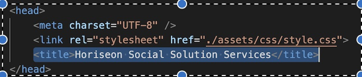
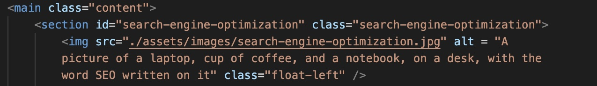
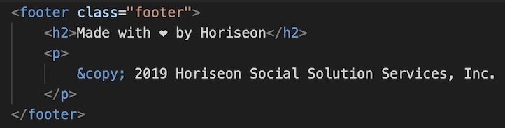

# Horiseon V.2 Refactored

## Description

- My goal in working on the code of this website was to change code to make it more accessible from a user standpoint, more readable from a devoloper standpoint and to rank higher in search engine results. This process involved learning how to make html elements more semantic, giving access to alts for images, therefore letting screen readers describe content easier to blind users, fixing elements to follow a more concise page structure, fixing broken links to make the page more dynamic and changing the title of the web page to be more descriptive. The work I did on this website also enabled me to practice good work flow and learn how to use proper git conventions.

## Installation

I created a new repo on github and pushed exisiting website html/css code to it. I then opened the code on vscode and began the process of adjusting code to make it more accessible to users, readable to developers and searchable for web browsers. 

## Live Demo

Live Demo Link - https://omer-weiss.github.io/Horiseon-V.2-Refactored/

## Usage

 In this screen shot code is shown that gives the title element a descriptive name so it will be easier to find for web browsers. 

  

In this screen shot code is shown that enables the search engine optimization link in the nav bar to properly work, thus making the site more accesbile and functional. This code also shows alt descriptions being given for images on the page so that they can be read by a screen reader, thus making it more accessible. 

In this screen shot code is shown that gave a div item at the bottom of the web page a more semantic title so that format, order, and readability of the pages html code improves. The div element was changed to a footer element instead.